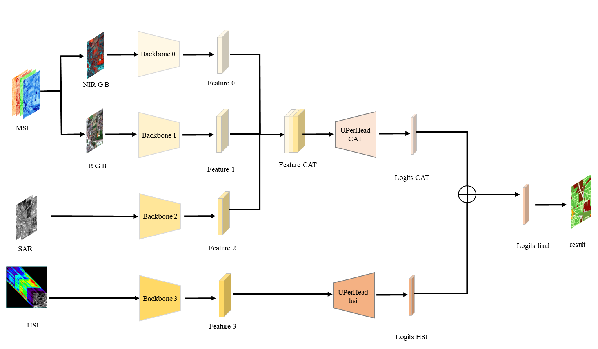

# MRSN
The codes of Multimodal Remote Sensing Network (MRSN).

* PaddleCD is adapted from [PaddleSeg](https://github.com/PaddlePaddle/PaddleSeg)
* work folder contains some auxiliary codes

For train and prediction process, you can find in [source code](https://aistudio.baidu.com/projectdetail/6562334) project.